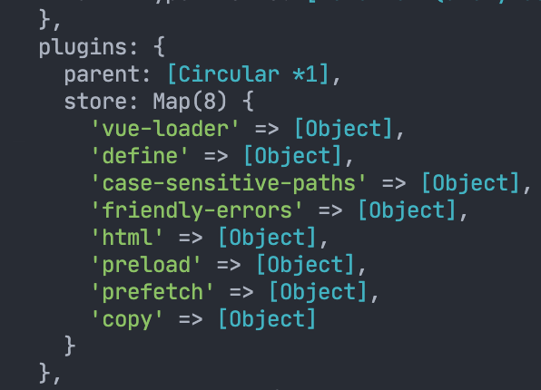
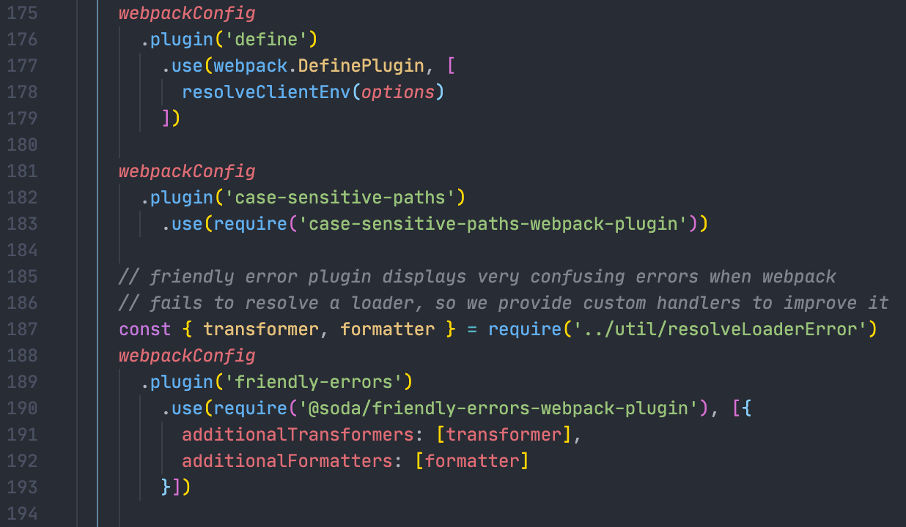

### 如何动态注入vue环境变量
&emsp;在vue开发过程中我们虽然可以在环境变量文件`.env`中定义`VUE_APP_XXX`，对app注入所需要的常量。比如常见的请求地址。但是这个环境变量如果是多变的呢？  

&emsp;我们完全可以把全部的可能性都定义成环境变量：比如VUE_APP_(A-Z)。然后配合vue cli提供的`mode`参数
 
&emsp;我们其实也可以通过外部传递参数的方式来注入环境变量，下面开始具体介绍。 

- 方法总共2步：
  - 第一步，我们首先通过终端对npm script传递参数。  
  比如我们有如下的npm script  

    ```javascript
      "scripts": {
        "grunt": "grunt",
        "server": "node server.js"
      }
    ```  
    我们可以通过`npm run server -- --port=1337`的方式去向`node serve.js`这条指令传递参数，即结果为`node serve.js --port=1337`，传递了`port`为`1337`这个参数.
  - 第二步就是通过`webpack`的`definePlugin`来进行注入。在vue中的操作方式即在`vue.config.js`文件中进行。例如
    
    ```javascript
    const { argv } = require('yargs') 
    // https://www.npmjs.com/package/yargs 
    // 这里引入的yargs是一个方便获取命令行参数的包，具体见url
    ...
    ...
    ...
    module.exports = {
      chainWebpack: (config) => {
        const specifiedPort = argv.port //从argv中获取到上文中我们传入进来的port
        config.plugin('define').tap(options => {
          // 注入环境变量VUE_APP_API_PORT
          options[0]['process.env'].VUE_APP_API_PORT = `"${specifiedPort}"`
          return options
        })
      }
    }
    ```
> 参考自：
> - https://forum.vuejs.org/t/how-to-pass-command-line-parameters-to-vue/38701/13  
> - https://stackoverflow.com/questions/11580961/sending-command-line-arguments-to-npm-script

### 附注：
&emsp;其实挺好奇`config.plugin('define')`中为什么用一个`define`就能操作webpack自带的`definePlugin`了。一般自用插件如果随便写个名字`config.plugin('插件名字')`肯定是找不到而且会报错的。还得在后面调用一下`.use('在这里显示引用一下你的插件')`。

&emsp;所以我们能够直接用`config.plugin('define')`肯定是有人把工作提前做好了。 

&emsp;在`vue.config.js`中跑一下`console.log(config) //这里的config是chainWebpack的参数`，可以发现在`config`中有个`plugins`对象如下图  

  

&emsp;在这个里面我们就很清晰的能看到有一些webpack内置的插件被定义了自定义名称，那么这个是在哪里操作的呢？

经过一番研究与测试在`node_modules/@vue/cli-service/lib/config/base.js`中发现了这么几段代码  

   

所以其实是vue cli已经预先将webpack内置的一些插件定义好了一些缩写名称。但是目前好像在文档中并没有找到对应的介绍。
