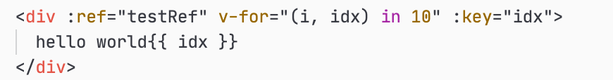

### 记录一次有赞vant框架bug反馈
&emsp;issue地址：[van-button 同时使用vfor和ref 获取ref只会得到最后一个元素 而不是一个数组](https://github.com/youzan/vant/issues/7229)  
&emsp;我们先来简单回顾一下，在vue中我们可以使用`ref=xxx`对一个dom元素进行引用。  
  
然后我们就可以在js中去使用`this.$refs.xxx`去获得我们之前引用的这个dom元素进行一些dom操作。

   

&emsp;以上是对单个dom元素进行ref引用的情况，那么如果将`ref`和`v-for`一起使用呢？我们可以在vue文档中找到这么一段话。  

  

我们也来自己尝试一下！  

   

  

可以发现和官网描述的一致。现在我们回到这篇文章的问题上，在vant中`v-for`和`ref`一起使用却只能获得最后一个dom元素。所以我们不妨先去vue中看看这块的部分实现。  

在vue中探寻后我们可以发现提供`ref`的功能实际上就在`registerRef`这个函数身上  

  

它实际上提供了删除功能，我们这里只看else部分，我们可以看到用来区分`$refs`结果的实际上由一个属性控制`vnode.data.refInFor`。vant中只会得到最后一个元素在这里就已经明朗了一部分，推测是vnode少了这个属性所以走了else分支`refs[key] = ref`所以只会保留最后一个元素。  

那么`refInFor`这个属性又是哪里提供的呢？我们可以在源码的`/src/compiler/parser/index.js`中很容易就找到

  

在`processRef`函数中定义了`refInFor`他是来自`checkInFor`这个检查函数的结果，我们再来看一下`checkInfor`  
  
`checkInFor`的功能实际上也很简单，往上遍历parent检查有没有`parent.for`这个属性，所以我们还得去找`parent.for`这个属性是在哪里定义的。  

  

我们可以在`parseFor`这个函数中很明显看到他是由一个正则`forAliasRE`匹配的结果  

  

至此vue中的`v-for`与`ref`一起使用的原理我们就探索完了。有了vue的基础我们就可以去考究一下vant的实现到底缺了什么。首先找到我们出现问题的组件`Button`，它是一个函数，函数体太长就略过了主要看参数和返回。  
  
  
发现返回中解构了个函数的结果`...inherit(ctx)`，我们首先去看一下它的参数ctx是哪里来的，可以反推得知是调用了`Button`函数传递进来的第四个参数。然后我们在这个组件底部可以看到是`createComponent`这个函数调用了`Button`这个组件函数。  
  
我们继续前进来看下`createComponent`的实现。  
  
我们发现`createComponent`实际上是通过`createNamespace`返回的，真面目还不在这里，我们继续深入。`createNamespace`是一个提供命名空间的多功能函数,它里面才返回了真正使用的`createComponent`，我们直接前进到真正的`createComponent`函数  

  

下图为真正使用的`createComponent`  
  

我们发现实际上`createComponent`返回一个函数，这个函数才是我们真正需要研究的，它的参数只有一个`sfc`也就是我们之前传入`Button`函数，当内部判断参数是一个函数时候，就调用了`transformFunctionComponent`。我们可以在其中发现实际上之前的`ctx`就是vue`函数式组件`的`render`函数的参数。至此`ctx`的来历我们就清楚了。  

然后我们来看导致问题的真正的地方`inherit`函数

  

在`src/utils/functional.ts`中我们可以看到`inherit`这个“继承”函数最终返回的类型`InheritContext`是一个VNodeData，同时这个函数是依赖于`inheritKey`这个数组的，由于数组里没有`refInFor`这个属性，所以自然而然vant组件们的VNodeData中也就”继承“不到这个属性。  
结合Vue的实现原理部分，所以每次都把后一个元素覆盖在了上一个元素注册的`refs[key]`位置，综上就导致了全文最开始的问题。